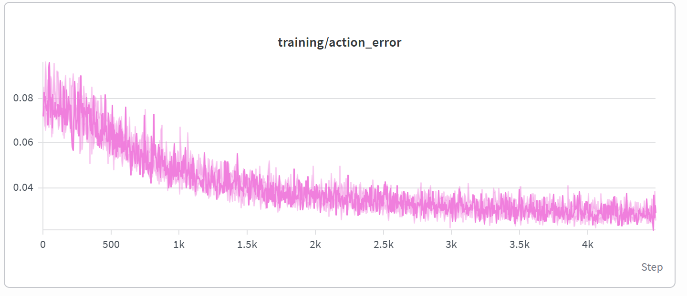
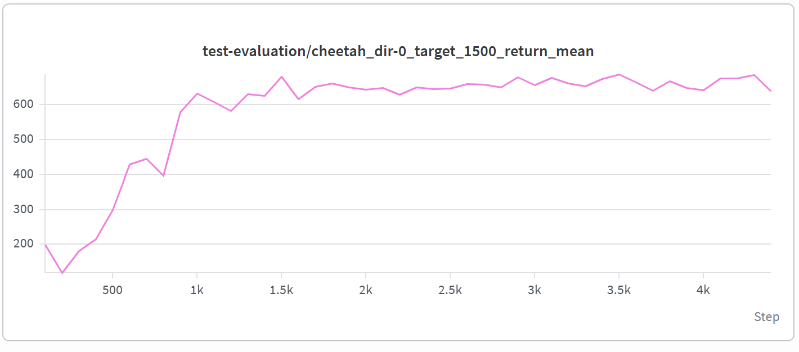
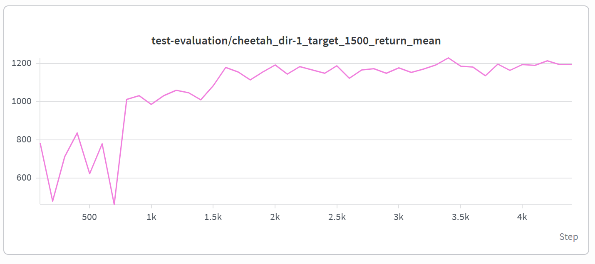

# Prompt Decision Transformer Reproduction

## Overview

This project reproduces the experiments of Prompt Decision Transformer for Offline Meta-Reinforcement Learning.

The goal is to understand and reproduce the implementation of prompt-based decision transformers in offline meta-RL.

## Environment

- OS: Ubuntu (WSL)
- Python: 3.8
- Framework: PyTorch
- Environment: MuJoCo
- Hardware: CPU

## Experiment Setup

### Environment

HalfCheetah-dir

### Training

- Training iterations: 5000
- Device: CPU
- Evaluation episodes: 5 per task

### Model

Checkpoint:
prompt_model_cheetah_dir_TRAIN_expert_TEST_expert_iter_4999

## Reproduction Results

Final evaluation results:

| Task | Return Mean | Return Std |
| ---- | ----------- | ---------- |
| cheetah_dir-0 | 681.53 | 16.68 |
| cheetah_dir-1 | 1166.08 | 48.83 |

## Visualization

### Training Action Error

### Evaluation Return

## Future Work

Further experiments will investigate how different prompt settings affect offline meta-RL performance.
